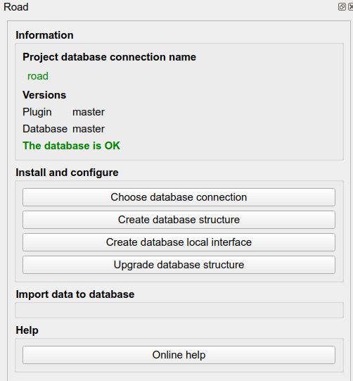

# RoadNetwork plugin

    

* QGIS extension repository : https://github.com/3liz/qgis-liz-example-plugin/releases/latest/download/plugins.xml
* QGIS extension documentation : https://docs.3liz.org/qgis-liz-example-plugin/

## Contributors

## Licence

GPL V2

## Setup

